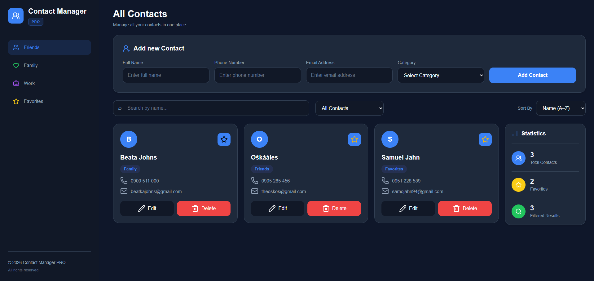

# 📇 Contact Manager PRO

A modern and responsive contact management application built with **HTML**, **CSS**, and **Vanilla JavaScript**.

Manage your contacts efficiently with features like searching, filtering, sorting, favorites, editing, and LocalStorage persistence.

---

## 🚀 Live Demo

🔗 https://johnyisbackk.github.io/js-contact-manager/

---

## ✨ Features

- ➕ Add new contacts
- ✏️ Edit existing contacts
- 🗑️ Delete contacts
- ⭐ Mark contacts as favorites
- 🔍 Live search by name
- 🏷️ Filter by category
- 🔤 Sort contacts (A–Z / Z–A)
- 📊 Live statistics
- 💾 LocalStorage persistence
- 📱 Fully responsive design
- 🎨 Modern dashboard interface
- ⚡ Smooth scrolling while editing

---

## 🛠️ Technologies

- HTML5
- CSS3
- JavaScript (ES6)
- LocalStorage API
- Lucide Icons

---

## 📷 Preview



---

## 📂 Project Structure

```
Contact Manager PRO
│
├── index.html
├── style.css
├── script.js
├── preview.png
├── license
└── README.md
```

---

## 📦 Installation

Clone the repository

```bash
git clone https://github.com/yourusername/contact-manager-pro.git
```

Open **index.html** in your browser.

---

## 🎯 Future Improvements

- Contact photo upload
- Import / Export contacts
- Multiple contact groups
- Dark / Light theme
- Contact notes
- Birthday reminders
- Pagination
- Cloud synchronization
